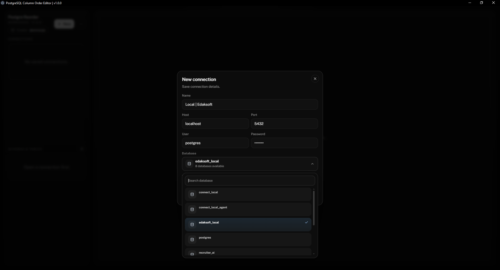
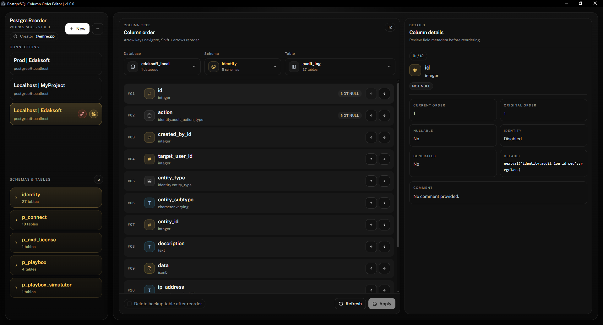

# 🐘 PostgreSQL Column Order Editor
Visual desktop tool for changing PostgreSQL column order.

## ❌ PostgreSQL Native Limitation
PostgreSQL does **not** support native column reordering with `ALTER TABLE`. There is no built-in `MOVE COLUMN`, `AFTER column`, or drag-drop column ordering feature in PostgreSQL’s official syntax. ([PostgreSQL][1])

There is **❌ no built-in** syntax such as:

```sql
ALTER TABLE users MOVE COLUMN email AFTER id;
```
✔️ **This app solves that problem with a clean desktop interface.**

---


## ⚙️ How It Works

When you apply a new column order, the app performs a workflow similar to:

```sql
BEGIN;

-- 1️⃣ Target table (`users` in this example) is locked to prevent reads/writes during migration
LOCK TABLE users IN ACCESS EXCLUSIVE MODE;

-- 2️⃣ Create a new temporary replacement table
--    Name pattern: originalTable_temp
--    Columns are created in the new desired order
CREATE TABLE users_temp (
  id bigint,
  email text,
  name text,
  created_at timestamp
);

-- 3️⃣ Copy all existing data into the new reordered table
INSERT INTO users_temp (id, email, name, created_at)
SELECT id, email, name, created_at
FROM users;

-- 4️⃣ Rename original table as backup
--    Name pattern: originalTable_backup
ALTER TABLE users RENAME TO users_backup;

-- 5️⃣ Rename new reordered table to original table name
--    users_temp becomes users
ALTER TABLE users_temp RENAME TO users;

-- 6️⃣ Commit transaction
--    Changes become permanent
COMMIT;
```

Then it restores:

* Constraints
* Indexes
* Triggers
* Sequences
* Ownership
* Comments
* Foreign key references

---

## ⚠️ Production Warning

This process uses an **ACCESS EXCLUSIVE LOCK** during migration.

That means:

* Reads may block
* Writes will block
* Requests may queue
* APIs depending on that table may slow down temporarily

Large tables can take significant time. PostgreSQL documents many ALTER/DDL operations requiring strong locks. ([PostgreSQL][1])

### Recommended:

* Run during maintenance windows
* Run during low traffic hours
* Backup first
* Test in staging environment

---

## 🖥 Screenshot




---

## 🚀 Install

### From Releases

Download latest version from GitHub Releases.

### Development

```bash
npm install
npm run dev
```

---

## 🧱 Tech Stack

* Electron
* React
* TypeScript
* PostgreSQL (`pg`)
* TailwindCSS
* Shadcn UI

---

## 🤝 Contributing

Issues and PRs welcome.

---

## 📄 License

MIT

---

## 👤 Author

GitHub @emrecpp

[1]: https://www.postgresql.org/docs/current/sql-altertable.html "Documentation: 18: ALTER TABLE"
